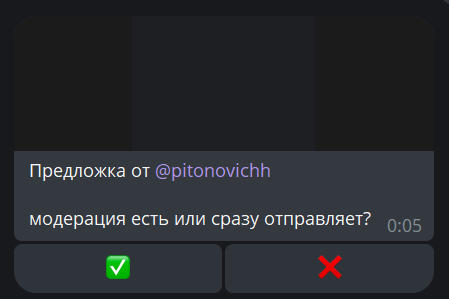

### belike group present...
# Предложка_бот!
Присылайте админам каналов новости и файлы. 

Бот пересылает сообщение админам на рассмотрение
и в случае одобрения отправляет пост в группу, 
уведомив пользователя.

Бот принимает на вход пока только фото и видео с приложенным текстом (одним сообщением)



Интуитивно понятный интерфейс - 2 inline-кнопки

## Установка:
### 1. Установка библиотек

```
pip install pyTelegramBotAPI
```

### 2. Настройка
Создайте ```config.py``` с тремя переменными:
```
TOKEN = ""  # токен бота из BotFather
ADMIN_IDS = [] # словарь с АЙДИ админов, указывайте через запятую
CHANNEL_ID = -100 # АЙДИ канала\группы, поставте -100 в начале, если -100 нет
```
### 3. Добавьте бота в чат

### 4. Запуск бота
Запуск бота через консоль:
```
 python main.py
```

## Связь со мной
* tg @saturdayboy
* email ivanguskov83@gmail.com